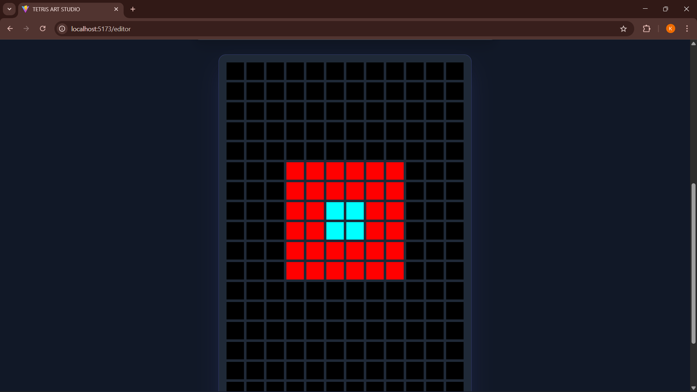
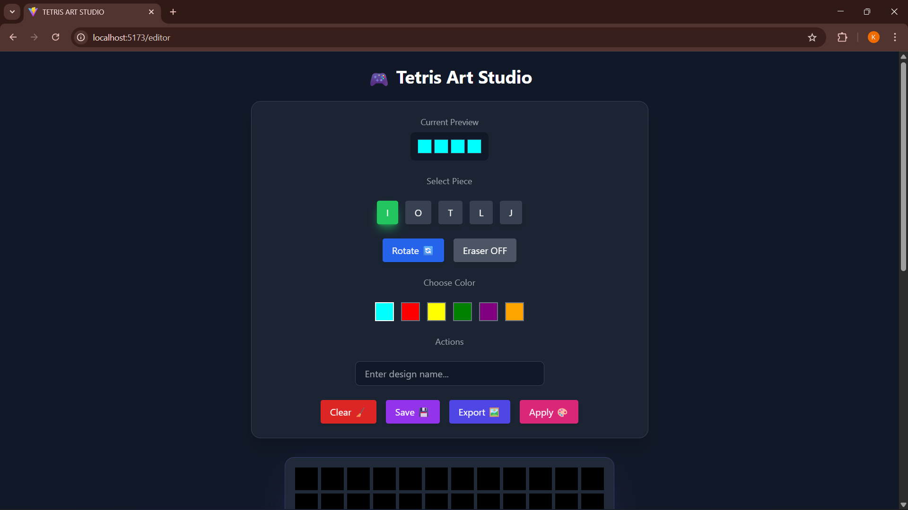
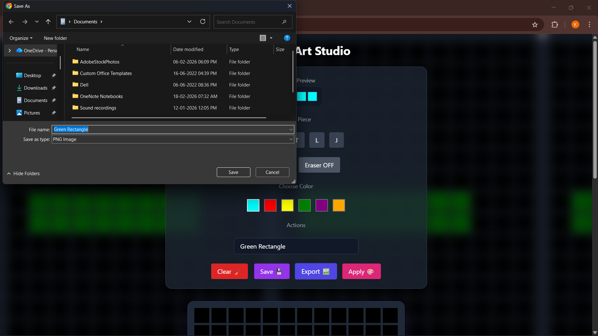
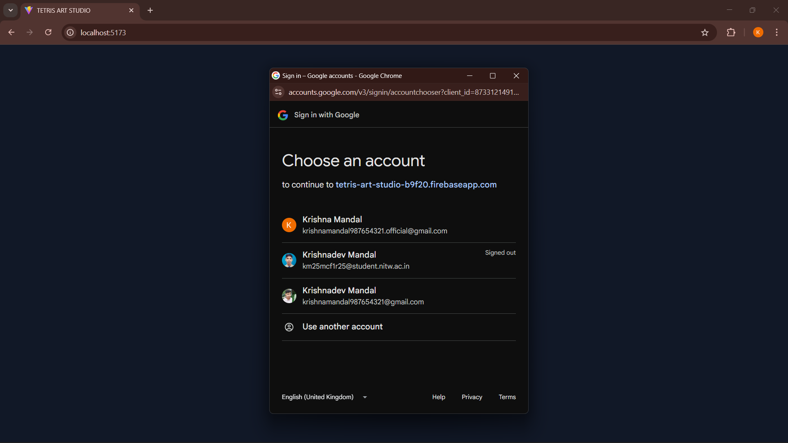
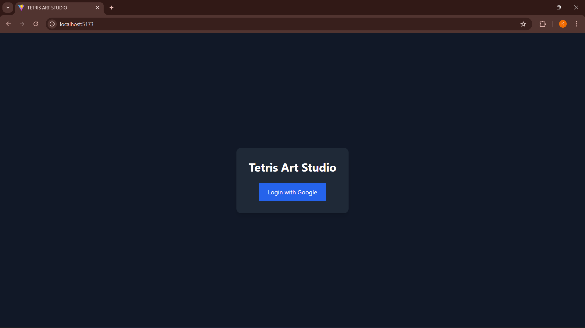

# 🎮 Tetris Art Studio

A web-based creative design tool inspired by classic Tetris mechanics.

## 🚀 Live Demo
🔗 [https://tetris-art-studio.vercel.app/]

---

## ✨ Features

- Interactive Tetris block canvas
- Block rotation system
- Undo / Redo support
- Cloud save with Firebase
- PNG export
- Background preview mode
- Toast notifications
- Audio feedback

---

## 📸 Screenshots

### 🧩 Canvas

### 📊 Dashboard

### ✏ Editor

### 🖼 File Export

### 🔐 Google Authentication

### 🔑 Login Page

---

## 🛠 Tech Stack

- React + Vite
- Tailwind CSS
- Firebase (Auth + Firestore)
- html2canvas
- Web Audio API

---

## 👨‍💻 Author

KRISHNADEV MANDAL
